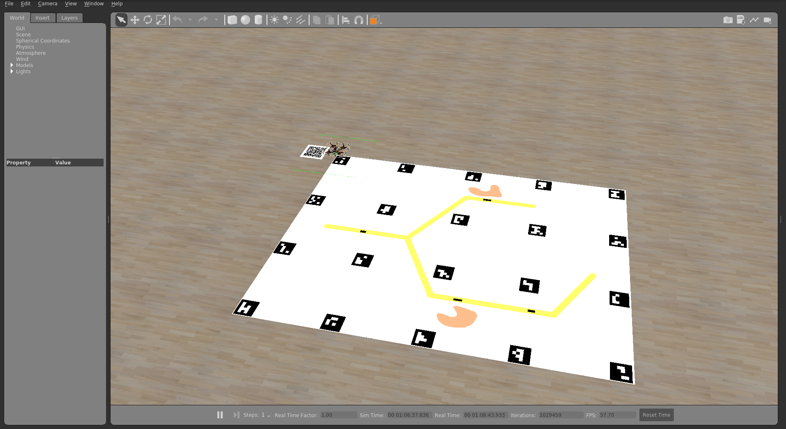
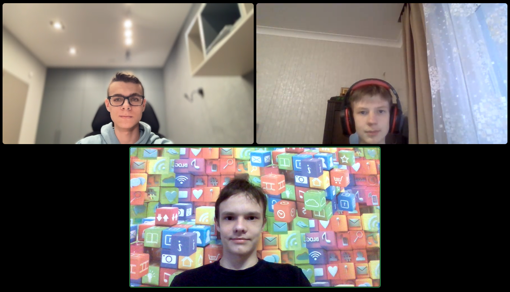
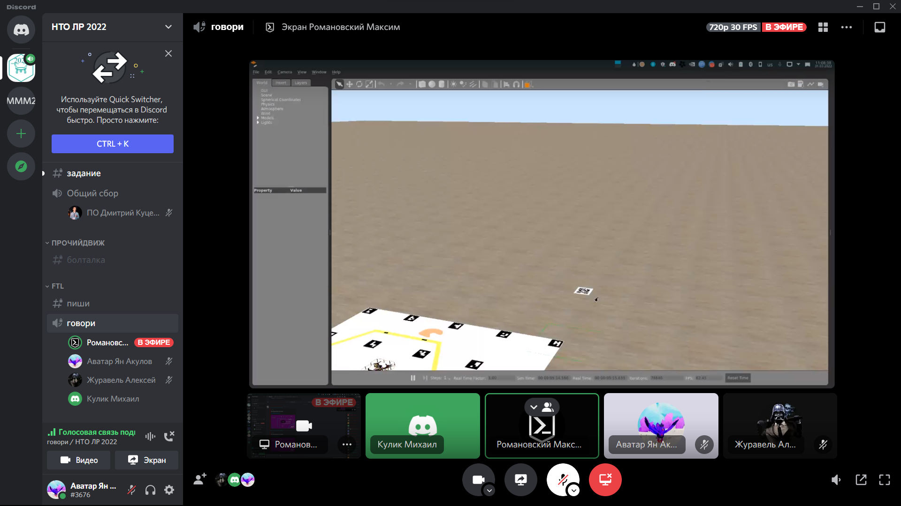
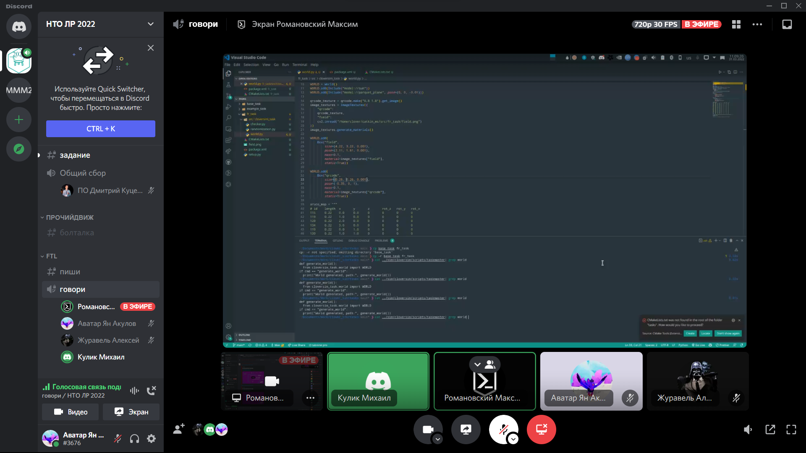
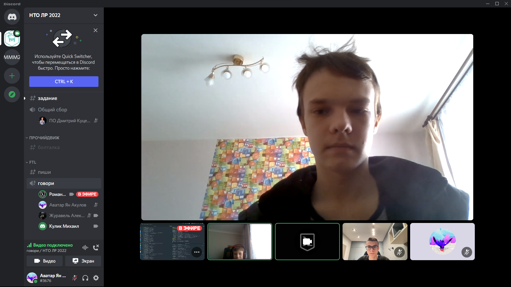
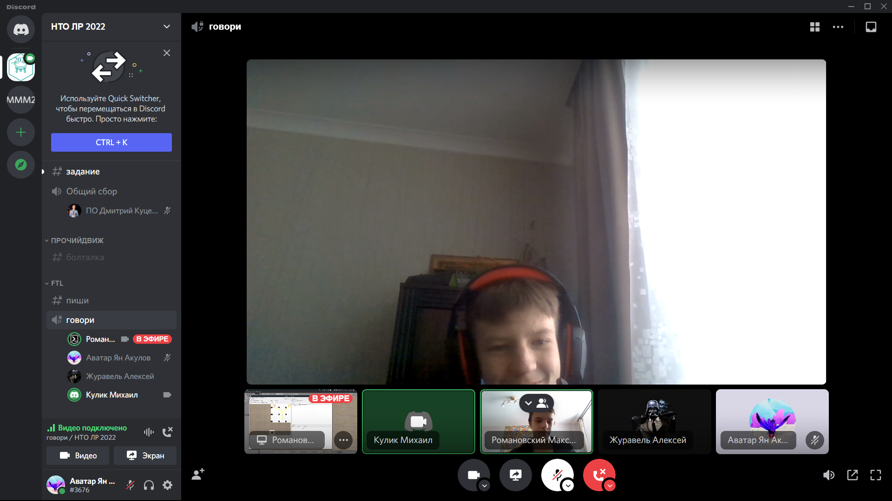
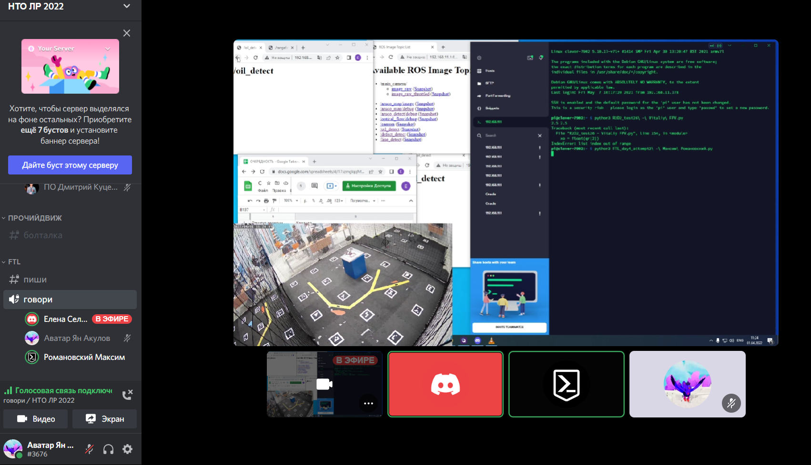

# Програмное задание

1. Взлёт с последющим сохранением кординат для сохранения высоты и кординат посадочной точки. 
2. Пробуем распознать qr-код, если не получилось поднимаемся чуть выше и пробуем ещё раз\
3. Декодируем кординаты из qr-кода, выводим их в терминал и получаем за это 1 балл
4. Летим к старту нефтепровода и получаем 1 балл за это
5. Летим к озеру
6. Получаем текущую высоты и садимся по body так чтобы осталось 0.5 метра от земли, получаем 2 балла
7. Взлетаем обратно на изначальную высоту и летим на зону посадки
8. Садимся и получаем 2 балла

## Симулятор

Так же у нас есть задание для [cloversim](https://github.com/FTL-team/clover_sim). Оно находится в папке fr_task, для использования задания нужно установить cloversim и скопировать fr_task в папку tasks в  cloversim после чего запустить с помощью `sudo ./clover_sim launch --task=fr_task nto_workspace`

# Инженерное задание

Устройство состоит из: 
- Емкости  103мл 
- Площадка крепления к деке
- Канат 2мм
- Болты 2.5 мм и 3 мм

# Командные фото

